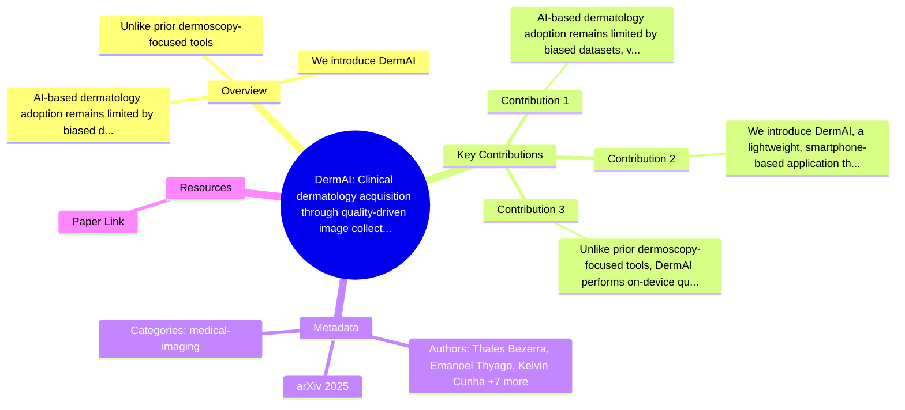

```mermaid
mindmap
  root((DermAI: Clinical dermatology acquisition through quality-driven image collect...))
    Overview
      AI-based dermatology adoption remains limited by biased d...
      We introduce DermAI
      Unlike prior dermoscopy-focused tools
    Key Contributions
      Contribution 1
        AI-based dermatology adoption remains limited by biased datasets, v...
      Contribution 2
        We introduce DermAI, a lightweight, smartphone-based application th...
      Contribution 3
        Unlike prior dermoscopy-focused tools, DermAI performs on-device qu...
    Metadata
      Authors: Thales Bezerra, Emanoel Thyago, Kelvin Cunha +7 more
      arXiv 2025
      Categories: medical-imaging
    Resources
      Paper Link
```