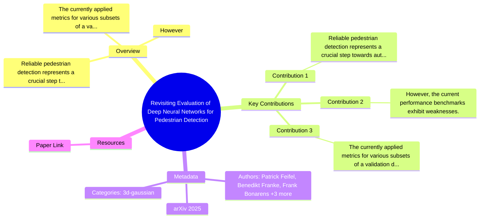

```mermaid
mindmap
  root((Revisiting Evaluation of Deep Neural Networks for Pedestrian Detection))
    Overview
      Reliable pedestrian detection represents a crucial step t...
      However
      The currently applied metrics for various subsets of a va...
    Key Contributions
      Contribution 1
        Reliable pedestrian detection represents a crucial step towards aut...
      Contribution 2
        However, the current performance benchmarks exhibit weaknesses.
      Contribution 3
        The currently applied metrics for various subsets of a validation d...
    Metadata
      Authors: Patrick Feifel, Benedikt Franke, Frank Bonarens +3 more
      arXiv 2025
      Categories: 3d-gaussian
    Resources
      Paper Link
```