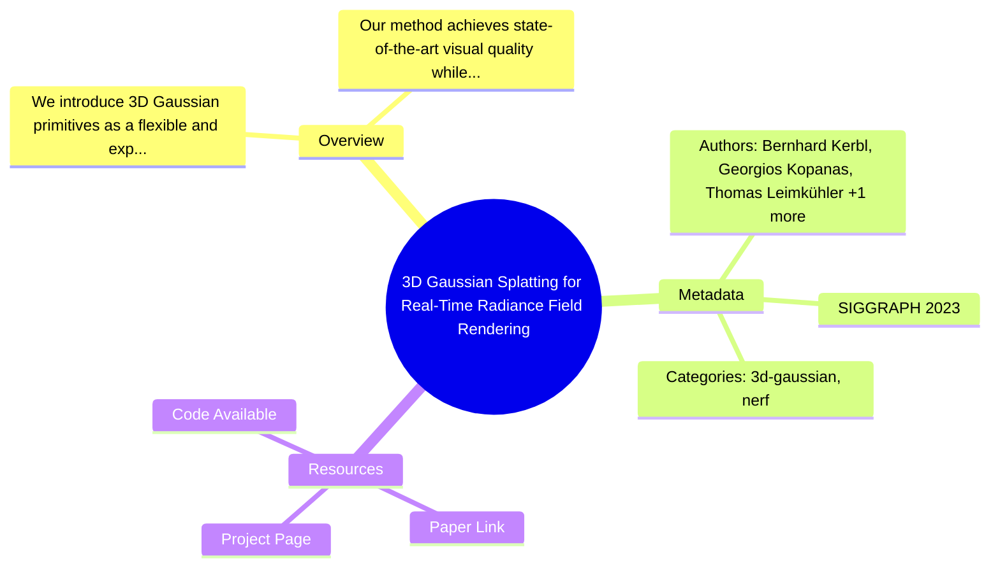

# Priority 1 Features Guide

This guide covers the newly implemented Priority 1 features: **Mindmap Generation** and **Citation Tracking**.

## 🧠 Mindmap Generation

### Overview

The mindmap generation feature automatically creates visual representations of paper structure using Mermaid.js. Each mindmap includes:

- Paper overview (key points from abstract)
- Key contributions (structured breakdown)
- Metadata (authors, venue, year, categories)
- Available resources (paper link, code, project page, video)

### Usage

#### Generate mindmaps for all papers

```bash
python scripts/generate_mindmap.py
```

This will:
- Read all papers from `data/papers/papers.yaml`
- Generate individual mindmap files for each paper
- Save to `static/mindmaps/{paper_id}_mindmap.md`

#### Generate mindmap for a specific paper

```bash
python scripts/generate_mindmap.py --paper-id gaussian-splatting-2023
```

This will output the mindmap to stdout.

#### Save specific paper mindmap to file

```bash
python scripts/generate_mindmap.py --paper-id <paper-id> --output-dir static/mindmaps
```

### Integration with Hugo

A Hugo shortcode is available for embedding mindmaps in your pages:

```markdown

```

The shortcode will:
1. Load the mindmap from `static/mindmaps/{paper_id}_mindmap.md`
2. Render it using Mermaid.js
3. Display it with a nice container and styling

### Automation

Mindmap generation is integrated into the daily paper update workflow:

- **Trigger**: Runs automatically every day at midnight UTC
- **Workflow**: `.github/workflows/daily-paper-update.yml`
- **Step**: "Step 4 - Generate mindmaps"

When new papers are added to the system, mindmaps are automatically generated.

### Example Output



---

## 📊 Citation Tracking

### Overview

The citation tracking system uses the free Semantic Scholar API to:

- Fetch citation counts for papers
- Track influential citations
- Maintain historical citation data
- Generate citation reports
- Identify high-impact papers

### Usage

#### Update citation counts for all papers

```bash
python scripts/citation_tracker.py
```

This will:
- Query Semantic Scholar API for each paper
- Update `citation_count` and `influential_citation_count` in `papers.yaml`
- Add historical data to `citation_history`
- Skip papers checked within the last 7 days (configurable)

#### Force update all papers

```bash
python scripts/citation_tracker.py --force
```

Ignores the 7-day check and updates all papers regardless of when they were last checked.

#### Generate citation report

```bash
python scripts/citation_tracker.py --report
```

This generates a detailed report including:
- Top papers by citation count
- High-impact papers (>100 citations)
- Rising stars (recent papers with >10 citations)
- Overall statistics

#### Save report to file

```bash
python scripts/citation_tracker.py --report --output reports/citation_report.md
```

### Data Structure

The citation tracking system adds the following fields to each paper in `papers.yaml`:

```yaml
papers:
  - id: example-paper
    # ... other fields ...
    citation_count: 42
    influential_citation_count: 8
    citation_last_checked: "2025-11-16T10:30:00"
```

Historical data is stored at the root level:

```yaml
citation_history:
  - date: "2025-11-16"
    papers:
      example-paper:
        citation_count: 42
        influential_count: 8
  - date: "2025-11-09"
    papers:
      example-paper:
        citation_count: 38
        influential_count: 7
```

### Automation

Citation tracking runs weekly via GitHub Actions:

- **Trigger**: Every Monday at 2 AM UTC (10 AM Beijing time)
- **Workflow**: `.github/workflows/weekly-citation-update.yml`
- **Actions**:
  1. Update citation counts for all papers
  2. Generate citation report
  3. Commit changes to repository
  4. (Future) Create issue for high-impact papers

### API Rate Limiting

The Semantic Scholar API has rate limits:

- **Default delay**: 1 second between requests (configurable)
- **Adjust delay**: Use `--delay <seconds>` flag

```bash
python scripts/citation_tracker.py --delay 2
```

### Example Report

```markdown
# Citation Report

Generated: 2025-11-16 10:30:00

Total Papers: 11

## Top Papers by Citations

1. **3D Gaussian Splatting for Real-Time Radiance Field Rendering** (2023)
   - Citations: 1234 (Influential: 89)

2. **Depth Anything 3: Recovering the Visual Space from Any Views** (2025)
   - Citations: 45 (Influential: 12)

## High Impact Papers (>100 citations)

- 3D Gaussian Splatting for Real-Time Radiance Field Rendering: 1234 citations

## Rising Stars (Recent Papers with >10 Citations)

- Depth Anything 3: Recovering the Visual Space from Any Views (2025): 45 citations

## Statistics

- Total Citations: 1279
- Average Citations per Paper: 116.3
- Papers with >0 Citations: 11
```

---

## 🔧 Advanced Configuration

### Mindmap Customization

Edit `scripts/generate_mindmap.py` to customize:

- **Text length**: `max_length` parameter in `sanitize_text()`
- **Max concepts**: `max_concepts` parameter in `extract_key_concepts()`
- **Max contributions**: Currently limited to 4, adjust in `generate_mindmap_from_paper()`

### Citation Tracking Customization

Edit `scripts/citation_tracker.py` to customize:

- **Check interval**: Change `timedelta(days=7)` in `update_citation_counts()`
- **History retention**: Currently 365 days, adjust in `update_citation_counts()`
- **High-impact threshold**: Change `>100` in `generate_citation_report()`

---

## 🐛 Troubleshooting

### Mindmap not displaying

1. Check if mindmap file exists: `static/mindmaps/{paper_id}_mindmap.md`
2. Verify Mermaid.js is loaded in your Hugo theme
3. Check browser console for JavaScript errors

### Citation tracking fails

1. **Network errors**: The Semantic Scholar API might be down. Try again later.
2. **Rate limiting**: Increase the delay between requests with `--delay 2`
3. **Invalid arXiv ID**: Check that papers have valid `arxiv_id` fields
4. **Paper not found**: Some papers might not be indexed in Semantic Scholar yet

### Citations not updating

1. Check `citation_last_checked` field - it might have been checked recently
2. Use `--force` flag to override the 7-day check
3. Verify arXiv ID format (should be like "2308.04079" or "2308.04079v1")

---

## 📈 Future Enhancements

Planned improvements for these features:

### Mindmap
- AI-powered section extraction for better structure
- Multi-level hierarchical mindmaps
- Color coding by topic/category
- Export to PNG/SVG formats

### Citation Tracking
- Email/Slack alerts for citation milestones
- Citation velocity tracking (citations per month)
- Comparative analysis (vs similar papers)
- Author citation tracking
- H-index calculation

---

## 📚 References

- [Mermaid.js Documentation](https://mermaid.js.org/)
- [Semantic Scholar API](https://www.semanticscholar.org/product/api)
- [Hugo Shortcodes](https://gohugo.io/content-management/shortcodes/)
