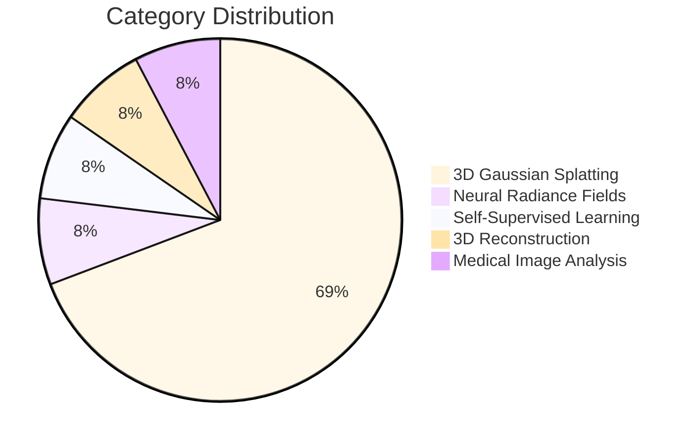
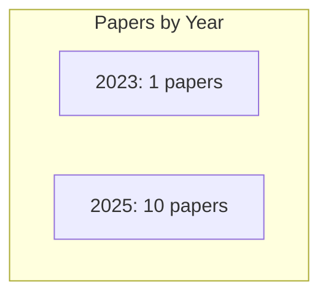
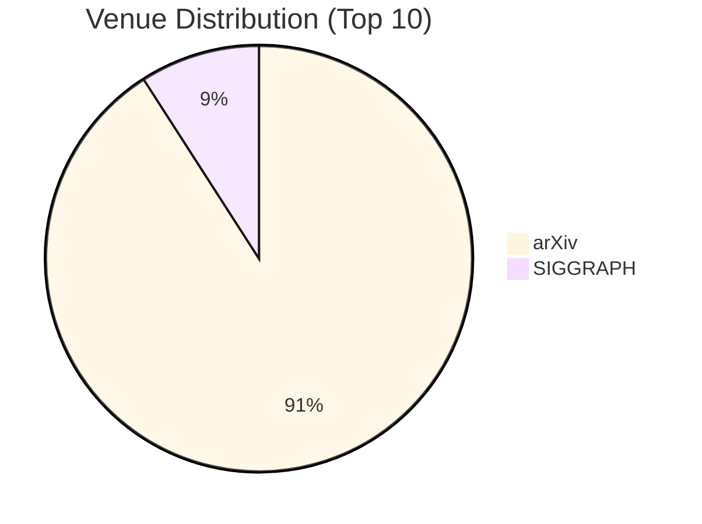
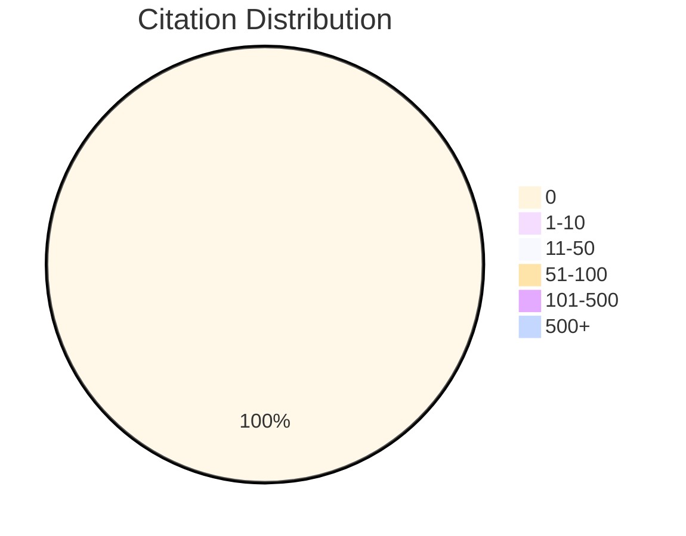

# Paper Collection Analysis Report

**Generated:** 2025-11-16 14:56:57

**Total Papers:** 11

---

## 📊 Overview Statistics

- **Year Range:** 2023 - 2025
- **Total Citations:** 0
- **Average Citations:** 0.0
- **Unique Authors:** 81
- **Unique Venues:** 2
- **Starred Papers:** 1

---

## 📚 Category Analysis

Category Distribution
=====================
3D Gaussian Splatting               ██████████████████████████████████████████████████ 9
Neural Radiance Fields              █████ 1
Self-Supervised Learning            █████ 1
3D Reconstruction                   █████ 1
Medical Image Analysis              █████ 1

---

## 📅 Timeline Analysis

Papers Over Time (2023-2025)
========================================
2023  ▓▓▓ 1
2024   0
2025  ▓▓▓▓▓▓▓▓▓▓▓▓▓▓▓▓▓▓▓▓▓▓▓▓▓▓▓▓▓▓ 10

---

## 🏛️ Venue Analysis

Top Venues
==========
arXiv                               ██████████████████████████████████████████████████ 10
SIGGRAPH                            █████ 1

---

## 📈 Citation Analysis

Citation Statistics
========================================
Total Citations: 0
Average: 0.0
Range: 0 - 0

Citation Distribution
=====================
0                                   ██████████████████████████████████████████████████ 11
1-10                                 0
11-50                                0
51-100                               0
101-500                              0
500+                                 0

---

## 👥 Author Analysis

Top Authors by Paper Count
==========================
Bernhard Kerbl                      ██████████████████████████████████████████████████ 1
Georgios Kopanas                    ██████████████████████████████████████████████████ 1
Thomas Leimkühler                   ██████████████████████████████████████████████████ 1
George Drettakis                    ██████████████████████████████████████████████████ 1
Wei Li                              ██████████████████████████████████████████████████ 1
Renshan Zhang                       ██████████████████████████████████████████████████ 1
Rui Shao                            ██████████████████████████████████████████████████ 1
Zhijian Fang                        ██████████████████████████████████████████████████ 1
Kaiwen Zhou                         ██████████████████████████████████████████████████ 1
Zhuotao Tian                        ██████████████████████████████████████████████████ 1

Top Authors by Total Citations
==============================
Bernhard Kerbl                       0
Georgios Kopanas                     0
Thomas Leimkühler                    0
George Drettakis                     0
Wei Li                               0
Renshan Zhang                        0
Rui Shao                             0
Zhijian Fang                         0
Kaiwen Zhou                          0
Zhuotao Tian                         0

---

## 🌟 Top Papers

1. **3D Gaussian Splatting for Real-Time Radiance Field Rendering** (2023) - 0 citations
2. **SemanticVLA: Semantic-Aligned Sparsification and Enhancement for Efficient Robotic Manipulation** (2025) - 0 citations
3. **Depth Anything 3: Recovering the Visual Space from Any Views** (2025) - 0 citations
4. **Learning to Tell Apart: Weakly Supervised Video Anomaly Detection via Disentangled Semantic Alignment** (2025) - 0 citations
5. **OmniVGGT: Omni-Modality Driven Visual Geometry Grounded** (2025) - 0 citations
6. **Depth-Consistent 3D Gaussian Splatting via Physical Defocus Modeling and Multi-View Geometric Supervision** (2025) - 0 citations
7. **Utility of Pancreas Surface Lobularity as a CT Biomarker for Opportunistic Screening of Type 2 Diabetes** (2025) - 0 citations
8. **DermAI: Clinical dermatology acquisition through quality-driven image collection for AI classification in mobile** (2025) - 0 citations
9. **Revisiting Evaluation of Deep Neural Networks for Pedestrian Detection** (2025) - 0 citations
10. **SPOT: Sparsification with Attention Dynamics via Token Relevance in Vision Transformers** (2025) - 0 citations

---

## 💡 Insights & Recommendations

- ⚠️  High number of uncited papers (11/11)

---

_This report was automatically generated by the Collection Analyzer tool._