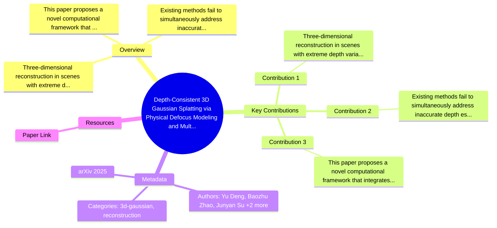

```mermaid
mindmap
  root((Depth-Consistent 3D Gaussian Splatting via Physical Defocus Modeling and Mult...))
    Overview
      Three-dimensional reconstruction in scenes with extreme d...
      Existing methods fail to simultaneously address inaccurat...
      This paper proposes a novel computational framework that ...
    Key Contributions
      Contribution 1
        Three-dimensional reconstruction in scenes with extreme depth varia...
      Contribution 2
        Existing methods fail to simultaneously address inaccurate depth es...
      Contribution 3
        This paper proposes a novel computational framework that integrates...
    Metadata
      Authors: Yu Deng, Baozhu Zhao, Junyan Su +2 more
      arXiv 2025
      Categories: 3d-gaussian, reconstruction
    Resources
      Paper Link
```