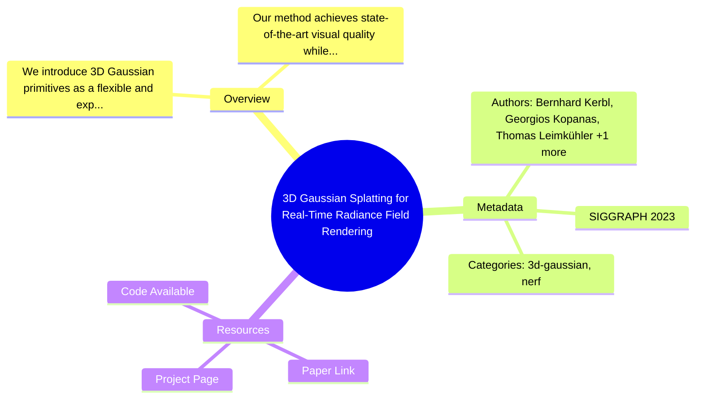

```mermaid
mindmap
  root((3D Gaussian Splatting for Real-Time Radiance Field Rendering))
    Overview
      We introduce 3D Gaussian primitives as a flexible and exp...
      Our method achieves state-of-the-art visual quality while...
    Metadata
      Authors: Bernhard Kerbl, Georgios Kopanas, Thomas Leimkühler +1 more
      SIGGRAPH 2023
      Categories: 3d-gaussian, nerf
    Resources
      Paper Link
      Code Available
      Project Page
```