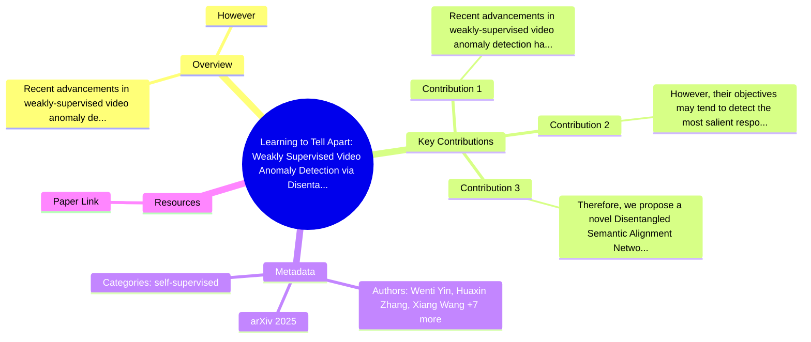

```mermaid
mindmap
  root((Learning to Tell Apart: Weakly Supervised Video Anomaly Detection via Disenta...))
    Overview
      Recent advancements in weakly-supervised video anomaly de...
      However
    Key Contributions
      Contribution 1
        Recent advancements in weakly-supervised video anomaly detection ha...
      Contribution 2
        However, their objectives may tend to detect the most salient respo...
      Contribution 3
        Therefore, we propose a novel Disentangled Semantic Alignment Netwo...
    Metadata
      Authors: Wenti Yin, Huaxin Zhang, Xiang Wang +7 more
      arXiv 2025
      Categories: self-supervised
    Resources
      Paper Link
```