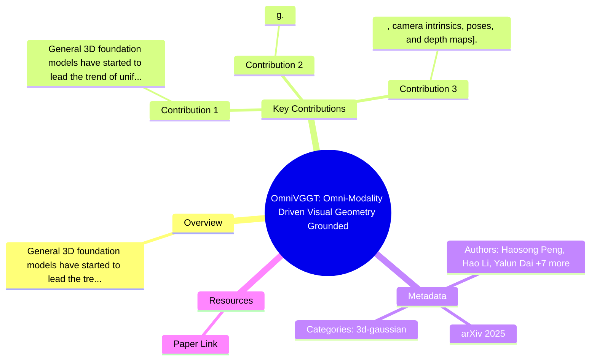

```mermaid
mindmap
  root((OmniVGGT: Omni-Modality Driven Visual Geometry Grounded))
    Overview
      General 3D foundation models have started to lead the tre...
      
    Key Contributions
      Contribution 1
        General 3D foundation models have started to lead the trend of unif...
      Contribution 2
        g.
      Contribution 3
        , camera intrinsics, poses, and depth maps].
    Metadata
      Authors: Haosong Peng, Hao Li, Yalun Dai +7 more
      arXiv 2025
      Categories: 3d-gaussian
    Resources
      Paper Link
```