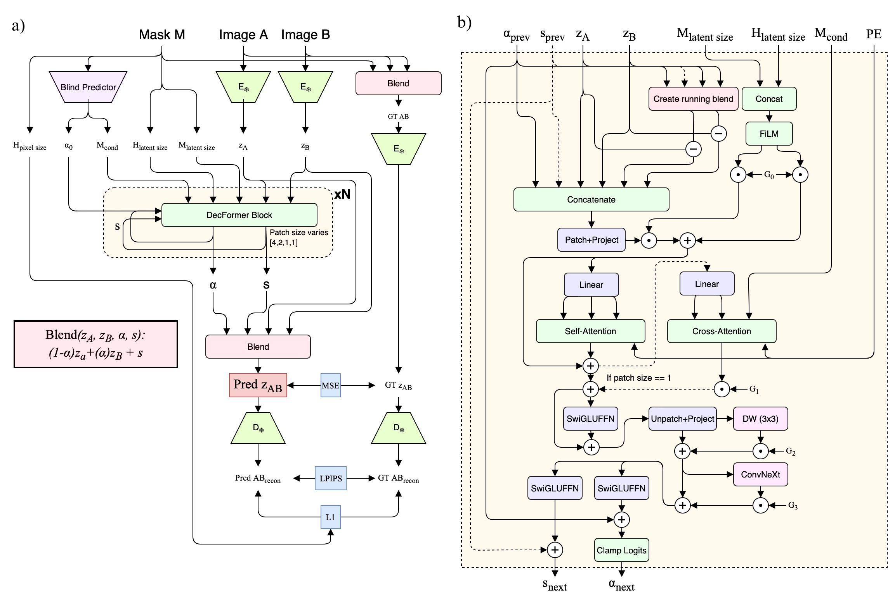
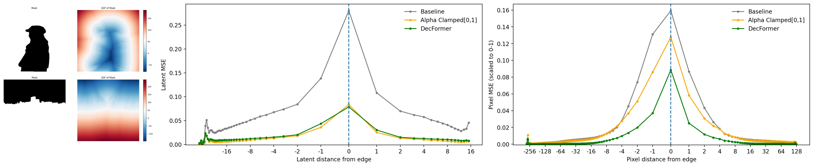

# Your Latent Mask is Wrong: Pixel-Equivalent Latent Compositing for Diffusion Models

Rowan Bradbury, Dazhi Zhong

原始发表：2025-12-04 · 版本：v1 · 入库：2026-10-07
[固定版本原文](https://arxiv.org/html/2512.05198v1)

作者报告与本页分析分开；未本地复现，未记录用户人工复核。

下采样掩码并广播到所有 latent 通道，会把“位置对应”误当成“像素等价”。本文用可学习的合成器替换这一捷径，重点修正接缝、软边缘与颜色泄漏。

## 01 · 为什么“看起来像图片”的 latent 不能直接拼？

阅读结论：应先定义希望在像素域实现的操作，再学习它在特定 VAE 潜空间中的对应算子。潜变量的空间网格只能提供粗略对应，不能保证掩码外像素不变。

[§1–2 · Eq.1–3](https://arxiv.org/html/2512.05198v1#S1)

普通做法把高分辨率 M 缩成 m，再把同一个 m 广播到每个通道。FLUX VAE 的空间步长为 8，但一个 latent 位置的影响远不止 8×8 像素：非线性解码、较宽感受野和通道耦合会让接缝误差向周围传播，细线与软透明度也会在降采样时丢失。

[§1–2 · Eq.1–3](https://arxiv.org/html/2512.05198v1#S1)

D(C\_F(z)) = F(D(z))
C\_F(E(x)) = E(F(x))

条件：E / D 是冻结的编码器 / 解码器，F 是目标像素操作，C\_F 是待学习的潜空间操作。训练只能逼近这一目标；名称中的 equivalent 不意味着每个样本严格零误差。

[§1–2 · Eq.1–3](https://arxiv.org/html/2512.05198v1#S1)

阅读版本固定为 2025-12-04 的 v1。以下数值均为作者报告；图表来源已核对，尚未本地复现。两位作者的论文与图像采用 CC BY 4.0，本文为中文解读。

## 02 · 三种修正位置，先分清任务

| 工作 | 干预位置 | 所学对象 | 证据边界 |
| --- | --- | --- | --- |
| DecFormer / PELC | 采样过程中的干净 latent 合成 | 逐通道 α + 残差 s | FLUX 图像合成 / inpainting |
| PixPerfect | 生成并解码后的像素图 | GAN refiner + 判别像素空间监督 | 自然图像局部修复 / 删除 / 插入 |
| LFV | 固定 VAE 的频率域 latent 操作 | 经筛选的 C1–CM 传递算子 | 四种视频 VAE 的指定频谱编辑 |

条件：本页综合分析。三篇研究目标、数据、指标与计时边界不同，此表仅比较方法位置，不构成性能排名。

PELC 修正的是“怎样融合”，不是“生成什么”。因此它可以与语义补全模型组合；PixPerfect 在最终图像端补救，LFV 为指定频谱操作选择可用的近似。这里是我们的跨论文归纳，不宣称三者已经组合验证。

## 03 · 从广播掩码到逐通道权重与残差

原文 Fig.3 · 训练路径与 DecFormer 模块 · Bradbury &amp; Zhong, 2025 · CC BY 4.0 · 原图未改动 · [授权](https://creativecommons.org/licenses/by/4.0/)

[§3 · Fig.3 · PDF p.4–6](https://arxiv.org/html/2512.05198v1#S3)

ẑ = (1 − α) ⊙ z\_A + α ⊙ z\_B + s
α ∈ \[0,1\]^(C×h×w)

条件：α 保留稳定的凸组合先验；s 负责两端连线之外的修正。与一个 m 广播 C 次不同，每个通道都有自己的 α。

[§3 · Fig.3 · PDF p.4–6](https://arxiv.org/html/2512.05198v1#S3)

1. 掩码先验：轻量 CNN 每个掩码运行一次，输出 α 初值与 mask tokens。
2. 多尺度合成：\[4,2,1,1\] patch 逐级细化，反复注入当前合成误差；FiLM 提供掩码与边缘 halo 条件。
3. 精细修正：末端 patch=1 的 cross-attention 对齐细边界，局部卷积抑制残留光晕。

[§3 · Fig.3 · PDF p.4–6](https://arxiv.org/html/2512.05198v1#S3)

z\_T = E((1 − M) ⊙ x\_A + M ⊙ x\_B)
L = λ\_E ‖ẑ − z\_T‖² + LPIPS(D(ẑ), D(z\_T))
    + λ\_H · HaloL1(D(ẑ), D(z\_T))

条件：解码端比较 D(z\_T)，不是直接拿原始像素合成图作所有项的目标。这样更聚焦合成器新增的误差。先训练 α，再渐进打开 s 与 halo loss。

[§3 · Fig.3 · PDF p.4–6](https://arxiv.org/html/2512.05198v1#S3)

z₀^θ = z\_t − t · v\_θ
z₀\* = DecFormer(z₀^θ, z₀^ref, M)
v\* = (z\_t − z₀\*) / t
z\_t′ = z\_t + (t′ − t) · v\*

条件：网络在未加噪的 z₀ 上训练。不能把它不加修改地套到任意 z\_t；论文按其流匹配时间约定重定向速度。端点数值处理仍需实现核验。

[§3 · Fig.3 · PDF p.4–6](https://arxiv.org/html/2512.05198v1#S3)

## 04 · 数据、训练和三种不同评估

| 部分 | 设置 | 阅读时要保留的条件 |
| --- | --- | --- |
| 训练图像 | Flickr30k 30k + WikiArt 10k + 内部网页图像100k | 不是公开数据即可完全重建的训练集合 |
| 训练掩码 | P3M、GFM、程序化形状 | 边缘与羽化增强 |
| 优化 | H100；batch=8；80k steps；AdamW | 训练分辨率256–384，宽高比0.5–2.0 |
| 纯合成 | COCO2017 val + Compositions-1k masks | Table 2：1024px、n=50；均值±95%CI |
| 扩散补全 | FLUX.1-Dev / LoRA / FLUX.1-Fill | 30步；COCO val中mask面积&gt;15%的样本 |
| 颜色变换 | gamma、对比度、亮度组合 | Table 4：n=1024，独立任务 |

条件：设置摘自固定v1的§3–4。合成样本数与补全样本口径不能互换；原文未在Tab.3表头给出最终筛选数量。

[§3 · Fig.3 · PDF p.4–6](https://arxiv.org/html/2512.05198v1#S3) · [Tab.2 · PDF p.6](https://arxiv.org/html/2512.05198v1#S4.T2) · [§4.3 · Tab.3 · PDF p.7](https://arxiv.org/html/2512.05198v1#S4.T3) · [Tab.4 · PDF p.8](https://arxiv.org/html/2512.05198v1#S4.T4)

复现前要核对的文字问题：§3 同时出现“80k steps”“约128 epochs”和“约10⁶ updates”，这些术语没有给出清楚的一一对应关系。本页采用明确写出的80k steps，不自行推算总样本遍历量。

[§3 · Fig.3 · PDF p.4–6](https://arxiv.org/html/2512.05198v1#S3)

## 05 · 合成更准，不等于语义补全全面更好

| 方法 | PSNR均值 dB ↑ | PSNR 95%CI | LPIPS ↓ | Halo L1 ↓ |
| --- | --- | --- | --- | --- |
| Heuristic | 32.9 | ±1.1 | 0.088 | 0.05 |
| DecFormer | 41.3 | ±0.8 | 0.027 | 0.018 |

条件：n=50；COCO2017验证图与Compositions-1k掩码；本表显示部分指标，LPIPS与Halo L1的CI请见原表。柱长表示PSNR，不能解释为画质的线性倍数。

[Tab.2 · PDF p.6](https://arxiv.org/html/2512.05198v1#S4.T2)

| 掩码 | Heuristic Halo L1 ↓ | DecFormer Halo L1 ↓ | DecFormer PSNR dB ↑ |
| --- | --- | --- | --- |
| Soft (σ=21) | 0.050 ±0.005 | 0.018 ±0.001 | 41.3 ±0.8 |
| Binary | 0.141 ±0.008 | 0.060 ±0.006 | 35.7 ±1.5 |
| Original | 0.080 ±0.007 | 0.037 ±0.005 | 38.6 ±1.5 |
| Thin | 0.174 ±0.009 | 0.073 ±0.005 | 34.7 ±1.5 |

条件：1024px；n=50；均值±95%置信区间。不是不同掩码难度相同的横向排行榜。

[Tab.2 · PDF p.6](https://arxiv.org/html/2512.05198v1#S4.T2)

原文 Fig.4 · 误差是否集中在掩码边界？ · Bradbury &amp; Zhong, 2025 · CC BY 4.0 · 原图未改动 · [授权](https://creativecommons.org/licenses/by/4.0/)

[Fig.4 · PDF p.7](https://arxiv.org/html/2512.05198v1#S4.F4)

| 方法 | PSNR dB ↑ | LPIPS ↓ | FID ↓ |
| --- | --- | --- | --- |
| Heuristic | 13.578 ±2.915 | 0.354 ±0.152 | 23.514 |
| DecFormer | 13.943 ±2.870 | 0.314 ±0.143 | 20.556 |
| LoRA only | 14.160 ±2.620 | 0.331 ±0.143 | 21.519 |
| FLUX.1-Fill | 16.750 ±3.199 | 0.313 ±0.125 | 19.343 |
| DecFormer + LoRA | 14.231 ±2.742 | 0.303 ±0.138 | 19.28 |

条件：COCO2017 val、mask面积&gt;15%、30步、相同prompt及guidance；此表±为标准差，不是95%CI。

[§4.3 · Tab.3 · PDF p.7](https://arxiv.org/html/2512.05198v1#S4.T3)

我们的判断：与 LoRA 组合时，LPIPS / FID 接近或略优于 FLUX Fill，但 PSNR 明显更低。只能说某些感知指标接近，不能写成“全面超过 Fill”。纯合成的41.3 dB也不能拿来与补全的14.231 dB比较。

## 06 · 消融：边缘与残差各自承担什么？

| 配置 | Halo L1 ↓ | LPIPS ↓ | MSE ↓ |
| --- | --- | --- | --- |
| 无 Halo L1 loss | 0.0973 ±0.0002 | 0.0299 ±0.0003 | 0.0297 ±0.0003 |
| 完整基线 | 0.0829 ±0.0018 | 0.0303 ±0.0015 | 0.0303 ±0.0003 |
| 无约束α、无shift | 0.1079 ±0.0012 | 0.0514 ±0.0012 | 0.0331 ±0.0003 |

条件：三种子，训练至80k steps；均值±95%CI。最后一行同时改变α约束与shift，不能视为严格单因素的“仅去掉shift”。

[Tab.1 · PDF p.6](https://arxiv.org/html/2512.05198v1#S4.T1)

去掉边缘损失后，全局 LPIPS / MSE 略好而边界 Halo L1 变差。这是很有用的提醒：如果研究目标是接缝质量，只报全图平均误差可能选错模型。残差分支的作用得到支持，但还需固定α约束的单因素对照才能单独量化它。

## 07 · 不能从这篇推出什么？

作者明确把任务限定为融合一致性。大范围、依赖语义的重建仍需要 mask-aware denoiser；其他 VAE、空间变换和时间一致的视频编辑仍属后续验证。7.7M / 3.4%也只代表所述模型与1024²、28步计算协议，并非任意设备上的实测时间增量。

[§5 · PDF p.8](https://arxiv.org/html/2512.05198v1#S5) · [§3 · Fig.3 · PDF p.4–6](https://arxiv.org/html/2512.05198v1#S3)

我们的追问：训练内部图像能否获得？正式代码、checkpoint、数据hash和端点调度细节是否完整？细小掩码与大幅域偏移下，s是否仍保持结构？本次没有验证可下载实现，也没有医学图像实验答案。

## 08 · 怎样变成自己的研究问题？

给04的候选启发：在任何学习合成器之前，先测当前 VAE 的“原图→编码→解码”和“局部mask潜空间替换”的差异，分别看掩码内、边界与外部区域。自然图像中的颜色一致性并不能证明 CT 强度、血管或病灶保真。当前配准与标签语义核验仍是前置条件。

给05的候选启发：把纹理接缝误差定位到像素合成、VAE解码或采样过程，避免一开始就增加生成网络规模。若目标是多视图一致性，还需要固定几何、光照和相机的跨视图对照；本篇没有提供这项证据。

1. 测量误差：冻结VAE与输入，对照像素合成、启发式latent合成和重复编解码。
2. 定位成因：按边界距离、mask宽度、mask内外分别统计，保留失败例。
3. 再谈迁移：只有基线确实显示该类误差，才评估学习合成器的成本和收益。

## 关联项目

- [04 · Medical FLUX](https://wind-rise-projects.fuxueming595.chatgpt.site/#project/codex-medical-flux/overview)：候选阅读启发；不改变现有数据、实验、预算和放行门禁。
- [05 · CVPR2027](https://wind-rise-projects.fuxueming595.chatgpt.site/#project/codex-cvpr2027-texture/overview)：用于分析局部纹理一致性与表征误差；单图或视频证据不等于多视图有效性。
