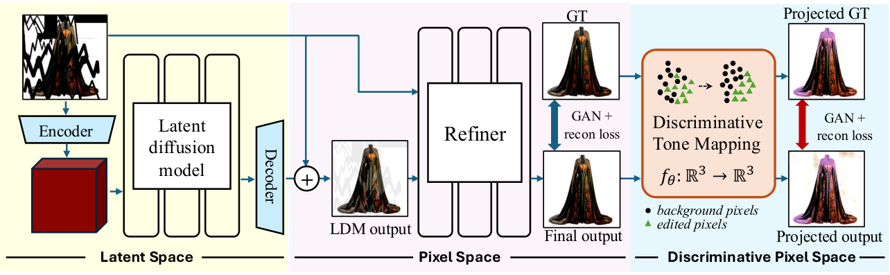
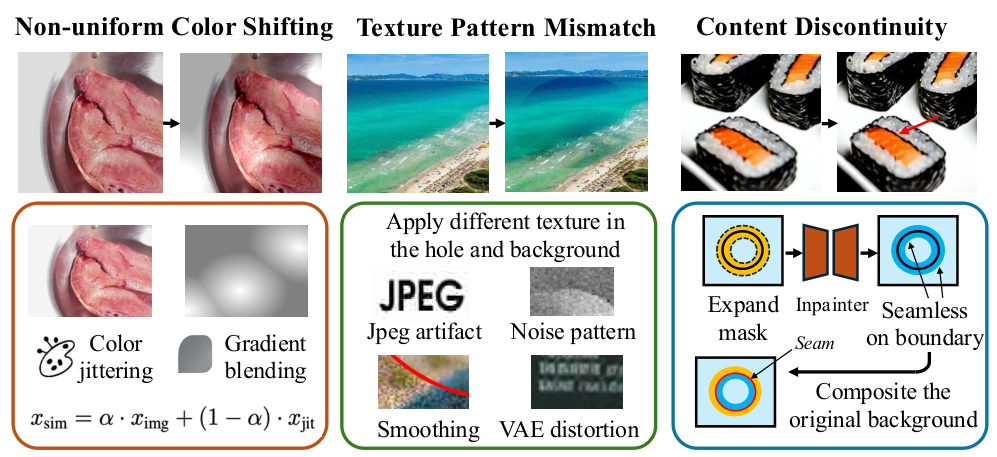

# PixPerfect: Seamless Latent Diffusion Local Editing with Discriminative Pixel-Space Refinement

Haitian Zheng, Yuan Yao, Yongsheng Yu, Yuqian Zhou, Jiebo Luo, Zhe Lin

原始发表：2025-12-02 · 版本：v1 · 入库：2026-10-07
[固定版本原文](https://arxiv.org/html/2512.03247v1)

作者报告与本页分析分开；未本地复现，未记录用户人工复核。

把修复放在解码后的像素空间：用人工合成的真实感伪影训练 refiner，再用可微的色调映射放大难以察觉的色差与纹理错配。收益之外，原文的几处实现与指标冲突也值得逐项保留。

## 01 · 为什么“背景贴回去”仍然有接缝？

阅读结论：背景完全保留，并不意味着生成区域自然接上背景。局部色差、噪声颗粒、压缩纹理和结构断点可能很小，却恰好集中在人眼敏感的边界。PixPerfect把这些误差当作单独的学习目标。

[§1–2 / App.A · PDF p.1–3,11](https://arxiv.org/html/2512.03247v1#S1)

作者将失败分为颜色漂移、纹理/噪声错配、内容断裂。依赖特定 latent decoder 的改造不便跨模型使用，传统harmonization也未必适合任意形状的局部生成区域。因此它只接收生成后的图像与mask，在像素域进行一次前向精修。

[§1–2 / App.A · PDF p.1–3,11](https://arxiv.org/html/2512.03247v1#S1)

阅读 NeurIPS 2025 论文的 arXiv v1（2025-12-02），作者报告尚未本地复现。图像按 Zheng 等作者的 CC BY 4.0 原图引用；本文为中文解读。

## 02 · 与 DecFormer 的互补在哪里？

| 工作 | 干预位置 | 所学对象 | 证据边界 |
| --- | --- | --- | --- |
| DecFormer / PELC | 采样过程中的干净 latent 合成 | 逐通道 α + 残差 s | FLUX 图像合成 / inpainting |
| PixPerfect | 生成并解码后的像素图 | GAN refiner + 判别像素空间监督 | 自然图像局部修复 / 删除 / 插入 |
| LFV | 固定 VAE 的频率域 latent 操作 | 经筛选的 C1–CM 传递算子 | 四种视频 VAE 的指定频谱编辑 |

条件：本页综合分析。三篇研究目标、数据、指标与计时边界不同，此表仅比较方法位置，不构成性能排名。

我们的分析：DecFormer减少生成过程中引入的融合误差；PixPerfect学习对最终输出做纠正。二者可能互补，也可能重复修正甚至覆盖细节。需要单独、串联及不处理的对照，不能仅凭模块位置就宣称叠加收益。

## 03 · 两个空间共同监督同一个 refiner

原文 Fig.1 · 解码后精修与双空间监督 · Zheng et al., 2025 · CC BY 4.0 · 原图未改动 · [授权](https://creativecommons.org/licenses/by/4.0/)

[§3.1 · Fig.1–2 · PDF p.3–5](https://arxiv.org/html/2512.03247v1#S3)

x\_pred = G(x\_gen, m)
L = L\_pixel-space + L\_discriminative-space

条件：G接收图像与mask。两个空间中均组合L1、LPIPS和条件对抗损失；判别色调映射用于训练监督，不是把测试图像永久染成另一种颜色。

[§3.1 · Fig.1–2 · PDF p.3–5](https://arxiv.org/html/2512.03247v1#S3)

y\_amp = x\_gt + β · (x\_pred − x\_gt),   β ∼ U\[20,40\]
f\_θ(x)\_c = Σ\_d p\_(c,d) · x\_c^d
y\_pred = f\_θ(x\_pred),   y\_gt = f\_θ(x\_gt)

条件：每样本、每RGB通道拟合可微多项式，Moore–Penrose伪逆求系数；mask内外平衡采样，并将映射结果clamp到合法范围。实际多项式阶数在正文中有冲突，见后文。

[§3.1 · Fig.1–2 · PDF p.3–5](https://arxiv.org/html/2512.03247v1#S3)

我们的解释：常规RGB误差可能把轻微但连续的色带当作小误差；这套训练把局部差异放大，让refiner受到更强的纠正信号。它改变的是学习时的关注点，不是证明放大后的度量与所有人类感知或医学诊断一致。

1. 训练配对：从干净图像合成人为伪影，获得可控的输入与目标。
2. 监督学习：RGB与自适应色调空间同时约束颜色、纹理和边界。
3. 部署精修：生成模型先完成内容，再由G精修；可选多次扰动与pooling，具体实现需核对。

[§3.1 · Fig.1–2 · PDF p.3–5](https://arxiv.org/html/2512.03247v1#S3) · [§3.2 · Fig.3 · PDF p.5–6](https://arxiv.org/html/2512.03247v1#S3.SS2) · [§3.3–4.1 · PDF p.6–7](https://arxiv.org/html/2512.03247v1#S4.SS1)

## 04 · 训练难点在于怎样制造“真的像错误”的数据

原文 Fig.3 · 三类伪影的合成路线 · Zheng et al., 2025 · CC BY 4.0 · 原图未改动 · [授权](https://creativecommons.org/licenses/by/4.0/)

[§3.2 · Fig.3 · PDF p.5–6](https://arxiv.org/html/2512.03247v1#S3.SS2)

| 项目 | 作者报告 | 边界 |
| --- | --- | --- |
| 训练集 | 约3亿张 curated images；1024² | 未在本次核对中获得可重建的公开清单 |
| 模型 | CMGAN改造为全卷积；41M参数 | 替换瓶颈全连接并做通道裁剪 |
| 优化 | Adam；lr=5e−4；batch=32；32×A100约1周 | w₁=64、w₂=5、w₃=1；初始关闭判别空间loss |
| Inpainting | MISATO 2000张512²；Places2验证抽样2000张 | 不与其他论文COCO结果交叉排位 |
| Removal | RORDS 500对图像 | 有人工mask与干净背景GT |
| Insertion | 300组背景/前景/合成三元组 | 作者同时说明合成GT不够可靠，因此也报无参考指标 |

条件：§4.1 / App.C 的设置；不是本地训练记录。公开代码与权重的可用性本次未验证。

[§3.3–4.1 · PDF p.6–7](https://arxiv.org/html/2512.03247v1#S4.SS1) · [App.C · PDF p.13,15](https://arxiv.org/html/2512.03247v1#A3)

伪影覆盖非均匀颜色变化、VAE重建与平滑、前后景不同JPEG/噪声、窄边缘inpainting、mask膨胀/腐蚀及模糊。注意§3.2开头概括“只在mask内退化”，但纹理小节明确对背景施加JPEG等变换；复现应按细节核对，不能照概括句实现。

[§3.2 · Fig.3 · PDF p.5–6](https://arxiv.org/html/2512.03247v1#S3.SS2)

## 05 · 同一上游模型，精修到底改善了多少？

| 方法 | LPIPS ↓ | FID ↓ | PSNR dB ↑ |
| --- | --- | --- | --- |
| FLUX-Fill | 0.195 | 14.66 | 20.9 |
| + Asymmetric VQGAN | 0.202 | 15.99 | 20.91 |
| + DiffHarmony++ | 0.19 | 14.02 | 20.89 |
| + PixPerfect | 0.141 | 10.87 | 22.18 |

条件：MISATO 2000张，固定表1同任务比较。未给出置信区间；不能根据小差异断言统计显著性。

[Tab.1 · PDF p.7](https://arxiv.org/html/2512.03247v1#S4.T1)

| 数据集 / 模型 | LPIPS ↓ | FID ↓ | PSNR dB ↑ |
| --- | --- | --- | --- |
| Places2 / FLUX-Fill | 0.24 | 19.05 | 19.33 |
| Places2 / + PixPerfect | 0.194 | 15.61 | 20.04 |
| MISATO / SDv1.5 | 0.229 | 18.15 | 19.01 |
| MISATO / SDv1.5 + PixPerfect | 0.171 | 13.25 | 20.4 |

条件：仅在每一对相同数据集和上游模型内部比较；Places2验证抽样2000张，MISATO 2000张。

[Tab.1 · PDF p.7](https://arxiv.org/html/2512.03247v1#S4.T1)

| 任务 / OmniPaint | FID ↓ | LPIPS ↓ | 补充指标 |
| --- | --- | --- | --- |
| Removal / 原始 | 23.05 | 0.094 | PSNR 24.67 |
| Removal / + PixPerfect | 18.87 | 0.06 | PSNR 27.96 |
| Insertion / 原始 | 56.8 | 0.186 | MANIQA 0.5029 |
| Insertion / + PixPerfect | 57.42 | 0.181 | MANIQA 0.5066 |

条件：删除：RORDS 500对；插入：300组三元组。原文未列CI。FID越低越好，因此插入的56.80→57.42是变差。

[Tab.2–3 · PDF p.9](https://arxiv.org/html/2512.03247v1#S4.T3)

核对结论：正文“所有基线所有指标均改善”写得过强。OmniPaint插入任务的FID升高，而LPIPS、L1和无参考指标改善。更准确的结论是：多数报告指标改善，但分布指标与逐图感知指标存在取舍。不能为叙述一致而删掉这一反例。

## 06 · 判别空间贡献最大，但不是每一项单调变好

| 配置 | FID ↓ | LPIPS ↓ | L1 ↓ |
| --- | --- | --- | --- |
| FLUX-Fill | 14.6585 | 0.195 | 0.0621 |
| + paste-back | 14.4022 | 0.1701 | 0.0395 |
| + refiner | 13.9874 | 0.1698 | 0.0402 |
| + enhance loss (d=6) | 10.9014 | 0.1425 | 0.0365 |
| + pooling | 10.8675 | 0.1414 | 0.0363 |

条件：表4逐步配置；同为MISATO。数字保留原文精度，没有误差条。

[§4.3 / Tab.4 · PDF p.9–10](https://arxiv.org/html/2512.03247v1#S4.T4)

我们的分析：paste-back主要去掉未编辑背景的失真；仅加refiner时L1从0.0395升到0.0402，说明组件并非对每项指标都单调有利。加入判别空间损失后的改善明显大于最后pooling那一步；但要判断性价比还需同设备、多次计时和随机种子。

| 位置 | 原文差异或缺项 | 本页处理 |
| --- | --- | --- |
| §4.1 vs §4.3 / Tab.4 | 最大多项式阶数D=5；后文默认d=6 | 保持冲突，待代码确认 |
| §3.3 pooling公式 | x\_pred本已定义为G输出，后面又与G输出求差 | 按字面可能为零；不擅自修公式 |
| App.B.1耗时 | 9.7s + 2.7s；精修占总时长21.8% | 相对原模型增加约27.8%，不是21.8%加速/增量 |
| 表3 vs正文 | OmniPaint插入FID恶化，正文称全部改善 | 保留真实表值 |

条件：这些是对固定v1的文献核对，不是确认作者实现错误。需要代码、补充说明或新版论文才能消除歧义。

[§3.3–4.1 · PDF p.6–7](https://arxiv.org/html/2512.03247v1#S4.SS1) · [§4.3 / Tab.4 · PDF p.9–10](https://arxiv.org/html/2512.03247v1#S4.T4) · [App.B.1 · PDF p.11–12](https://arxiv.org/html/2512.03247v1#A2.SS1) · [Tab.2–3 · PDF p.9](https://arxiv.org/html/2512.03247v1#S4.T3)

## 07 · 照片更自然，也可能改变不该改变的细节

作者强调它不能纠正上游的重大语义错误，依赖合理的初始结果和已知编辑mask。App.B.1报告512²、单A100：FLUX-Fill约9.7s，refiner增加2.7s；pooling后整体仍在1.3倍基线以内。该表述没有给出足以重建pooling成本的完整计时配置。

[§5 · PDF p.9](https://arxiv.org/html/2512.03247v1#S5) · [App.B.1 · PDF p.11–12](https://arxiv.org/html/2512.03247v1#A2.SS1)

我们的追问：精修会不会“合理化”错误结构？背景是否逐像素保持、细节是否被GAN重绘，需要单独检验。训练3亿图像并非廉价复现路径；如果没有可用权重，轻量推理不代表低训练成本。Poisson对照用了作者特定的GT梯度设置，也不能推出所有Poisson blending实现都需要测试GT。

## 08 · 对纹理研究有启发，对医学迁移先设边界

给05的候选启发：先建立包含非均匀颜色、不同噪声、硬/软边界和内容错位的误差分类，再查看现有纹理模型究竟在哪类失败。独立的边界评价与视角间一致性评价要一起保留，单视图更顺眼不足以证明3D材质正确。

给04的候选启发：可借鉴“针对真实失败合成扰动”的训练思路，但不能直接把照片GAN精修器用于CT并以自然度验收。HU/强度、细血管、病灶和拓扑可能被改变，现有mask语义、局部对应与医学门禁必须先解决。

1. 收集失败：以现有固定样本记录颜色、纹理与结构问题，避免挑好例子。
2. 冻结条件：比较不精修、简单paste-back和候选精修，保留mask外差异图。
3. 验收细节：检查目标相关结构是否保留，再权衡感知收益与额外延迟。

## 关联项目

- [04 · Medical FLUX](https://wind-rise-projects.fuxueming595.chatgpt.site/#project/codex-medical-flux/overview)：候选阅读启发；不改变现有数据、实验、预算和放行门禁。
- [05 · CVPR2027](https://wind-rise-projects.fuxueming595.chatgpt.site/#project/codex-cvpr2027-texture/overview)：用于分析局部纹理一致性与表征误差；单图或视频证据不等于多视图有效性。
